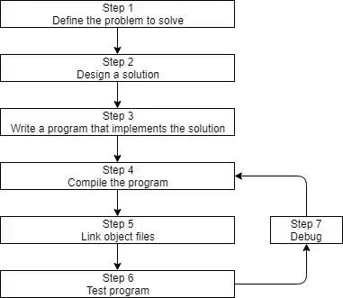

# [Learn cpp](https://www.learncpp.com/)

[C++ Reference](https://en.cppreference.com/w/)

[C++ Core Guidelines](https://isocpp.github.io/CppCoreGuidelines/CppCoreGuidelines)

Started: 2024-09-03

# [Chapter 0: Introduction](https://www.learncpp.com/cpp-tutorial/introduction-to-these-tutorials/)

## C and C++’s philosophy

The underlying design philosophy of C and C++ can be summed up as "trust the programmer" -- which is both wonderful and dangerous. C++ is designed to allow the programmer a high degree of freedom to do what they want. However, this also means the language often won’t stop you from doing things that don’t make sense, because it will assume you’re doing so for some reason it doesn’t understand. There are quite a few pitfalls that new programmers are likely to fall into if caught unaware. This is one of the primary reasons why knowing what you shouldn’t do in C/C++ is almost as important as knowing what you should do.

## C++ development



### Step 1: Define the problem that you would like to solve

This is the "what" step, where you figure out what problem you are intending to solve. Coming up with the initial idea for what you would like to program can be the easiest step, or the hardest. But conceptually, it is the simplest. All you need is an idea that can be well defined, and you’re ready for the next step.

### Step 2: Determine how you are going to solve the problem

This is the "how" step, where you determine how you are going to solve the problem you came up with in step 1. It is also the step that is most neglected in software development. The crux of the issue is that there are many ways to solve a problem -- however, some of these solutions are good and some of them are bad. Too often, a programmer will get an idea, sit down, and immediately start coding a solution. This often generates a solution that falls into the bad category.

Typically, good solutions have the following characteristics:

- They are straightforward (not overly complicated or confusing).
- They are well documented (especially around any assumptions being made or limitations).
- They are built modularly, so parts can be reused or changed later without impacting other parts of the program.
- They are robust, and can recover or give useful error messages when something unexpected happens.

When you sit down and start coding right away, you’re typically thinking "I want to do <something>", so you implement the solution that gets you there the fastest. This can lead to programs that are fragile, hard to change or extend later, or have lots of bugs. A bug is any kind of programming error that prevents the program from operating correctly.

Consequently, it’s worth your time to spend a little extra time up front (before you start coding) thinking about the best way to tackle a problem, what assumptions you are making, and how you might plan for the future, in order to save yourself a lot of time and trouble down the road.

### Step 3: Write the program
**Best practice**

Name the first/primary source code file in each program main.cpp. This makes it easy to determine which source code file is the primary one.

### Step 4: Compiling your source code

In order to compile C++ source code files, we use a C++ compiler. The C++ compiler sequentially goes through each source code (.cpp) file in your program and does two important tasks:

First, the compiler checks your C++ code to make sure it follows the rules of the C++ language. If it does not, the compiler will give you an error (and the corresponding line number) to help pinpoint what needs fixing. The compilation process will also be aborted until the error is fixed.

Second, the compiler translates your C++ code into machine language instructions. These instructions are stored in an intermediate file called an object file. The object file also contains metadata that is required or useful in subsequent steps.

Object files are typically named name.o or name.obj, where name is the same name as the .cpp file it was produced from.

### Step 5: Linking object files and libraries

After the compiler has successfully finished, another program called the linker kicks in. The linker’s job is to combine all of the object files and produce the desired output file (typically an executable file). This process is called linking.

First, the linker reads in each of the object files generated by the compiler and makes sure they are valid.

Second, the linker ensures all cross-file dependencies are resolved properly. For example, if you define something in one .cpp file, and then use it in a different .cpp file, the linker connects the two together. If the linker is unable to connect a reference to something with its definition, you’ll get a linker error, and the linking process will abort.

Third, the linker also is capable of linking library files. A library file is a collection of precompiled code that has been "packaged up" for reuse in other programs.

### Steps 6 & 7: Testing and Debugging

This is the fun part! You are now able to run your executable and see what it does!

Once you can run your program, then you can test it. Testing is the process of assessing whether your software is working as expected. Basic testing typically involves trying different input combinations to ensure the software behaves correctly in different cases.

If the program does not behave as expected, then you will have to do some debugging, which is the process of finding and fixing programming errors.

## Compiler configuration
See `ch00/makefile` for the configuration of the compiler.


# [Chapter 1: C++ Basics](https://www.learncpp.com/cpp-tutorial/statements-and-the-structure-of-a-program/)

## Statements and the structure of a program

### Statements
A statement is a type of instruction that causes the program to perform some action. Types of statements:
- Declaration statements
    - Definition statements
- Jump statements
- Expression statements
- Compound statements
- Selection statements (conditionals)
- Iteration statements (loops)
- Try blocks

### Functions and the main function
A function is a collection of statements that get executed sequentially. Every C++ program must have a special function named **main**. When the program is run, the statements inside of `main` are executed in sequential order. The name of a function (or object, type, template, etc…) is called its identifier.

### Dissecting Hello world!
```cpp
#include <iostream>             // 1
                                // 2
int main()                      // 3
{                               // 4
   std::cout << "Hello world!"; // 5
   return 0;                    // 6
}                               // 7
```
- Line 1: is a special type of line called a preprocessor directive, indicating that we would like to use the contents of the `iostream` library.
- Line 3: define a function with identifier `main` that returns an integer.
- Line 4 & 7: define the body of the `main` function.
- Line 5: is a statement that **c**haracter **out**put to the console using the `<<` operator.
- Line 6: is a statement that returns the integer value `0` to the operating system, indicating that the program completed successfully.

## Comments
- Single line comments: `//`
- Multi-line comments: 
```cpp
/* This is a multi-line comment.
 * the matching asterisks to the left
 * can make this easier to read
 */
```
Comments should be used for three things: 
1. At the library, program, or function level, use comments to describe **what**.
1. Inside the library, program, or function, use comments to describe **how**.
1. At the statement level, use comments to describe **why**.

## Introduction to objects and variables
### Data and values
In computing, data is any information that can be manipulated: reading, changing, and writing. The "Hello world" program manipulates the data "Hello World!" by sending it to the monitor to be displayed.

A single piece of data is called a value. Common examples of values include letters (e.g. `a`), numbers (e.g. `5`), and text (e.g. `Hello`).

### Random Access Memory (RAM)
You can think of RAM as a series of numbered boxes that can be used to store data while the program is running.

### Objects and variables
In C++, direct memory access is discouraged. Instead, we access memory indirectly through an object. An object is a region of storage (usually memory) that can store a value, and has other associated properties. Rather than say "go get the value stored in box number 7532", we can say, "go get the value stored by this object" and let the compiler figure out where and how to retrieve the value.

An **object** is used to store a value in memory. A **variable** is an object that has an identifier.

### Variable instantiation
```cpp
int x; 
```
At **compile time**, this statement defines a variable, giving it the identifier `x`, and the data type `int`. At **runtime**, the variable will be instantiated (created and assigned a memory address). An instantiated object is sometimes called an **instance**.

### Data types
A **data type** (more commonly just called a **type**) determines what kind of value (e.g. a number, a letter, text, etc…) the object will store. In C++, the type of an object **must be known at compile time**, and that type can not be changed without recompiling the program (static typing).

### Defining variables
```cpp
int a, double b; // wrong (compiler error)

int a; double b; // correct (but not recommended)
int a, b; // correct (but not recommended)

// correct and recommended (easier to read)
int a;
int b;
double c;
```
### Summary
In C++, we use objects to access memory. A named object is called a variable. Variables have an identifier, a type, and a value (and some other attributes that aren’t relevant here). A variable’s type is used to determine how the value in memory should be interpreted.

## [Variable assignment and initialization](https://www.learncpp.com/cpp-tutorial/variable-assignment-and-initialization/)

### Variable assignment
Is done using the assignment operator `=`. The value on the right side of the assignment operator is assigned to the variable on the left side.

### Variable initialization
Is the process of giving a variable an initial value. Different forms of initialization:
```cpp
int a;         // default-initialization (no initializer)

// Traditional initialization forms:
int b = 5;     // copy-initialization (initial value after equals sign)
int c ( 6 );   // direct-initialization (initial value in parenthesis)

// Modern initialization forms (preferred):
int d { 7 };   // direct-list initialization (initial value in braces)
int f {};      // value-initialization (empty braces)
```
- Copy-initialization is also used whenever values are implicitly copied, such as when passing arguments to a function by value, returning from a function by value, or catching exceptions by value.
- One of the reasons direct-initialization had fallen out of favor is because it makes it hard to differentiate variables from functions.
- List-initialization was introduced to provide a consistent initialization syntax (which is why it is sometimes called “uniform initialization”) that makes it clear we’re doing initialization.

The primary benefit of list-initialization is that “narrowing conversions” are disallowed. This means that if you try to list-initialize a variable using a value that the variable can not safely hold, the compiler is required to produce a diagnostic (usually an error). For example:
```cpp
int main()
{
    // An integer can only hold non-fractional values
    int w1 { 4.5 }; // compile error: list init does not allow narrowing conversion of 4.5 to 4

    int w2 = 4.5;   // compiles: copy-init initializes width with 4
    int w3(4.5);    // compiles: direct-init initializes width with 4

    w1 = 4.5;       // okay: copy-assignment allows narrowing conversion of 4.5 to 4

    return 0;
}
```

List-initialization is generally preferred over the other initialization forms because it works in most cases (and is therefore most consistent), it disallows narrowing conversions (which we normally don’t want), and it supports initialization with a list of values (something we’ll cover in a future lesson).

Use direct-list-initialization when you’re actually using the initial value. Use value-initialization when the object’s value is temporary and will be replaced:
```cpp
int x { 0 };    // direct-list-initialization with initial value 0
std::cout << x; // we're using that 0 value here

int x {};      // value initialization
std::cin >> x; // we're immediately replacing that value so an explicit 0 would be meaningless
```

**Initialize your variables upon creation. You may eventually find cases where you want to ignore this advice for a specific reason (e.g. a performance critical section of code that uses a lot of variables), and that’s okay, as long as the choice is made deliberately.**

[[maybe_unused]] attribute:
```cpp
#include <iostream>

int main()
{
    [[maybe_unused]] double pi { 3.14159 };  // Don't complain if pi is unused
    [[maybe_unused]] double gravity { 9.8 }; // Don't complain if gravity is unused
    [[maybe_unused]] double phi { 1.61803 }; // Don't complain if phi is unused

    std::cout << pi << '\n';
    std::cout << phi << '\n';

    // The compiler will no longer warn about gravity not being used

    return 0;
}
```

Additionally, the compiler will likely optimize these variables out of the program, so they have no performance impact.

The [[maybe_unused]] attribute should only be applied selectively to variables that have a specific and legitimate reason for being unused (e.g. because you need a list of named values, but which specific values are actually used in a given program may vary).

## [Introduction to iostream: cout, cin, and endl](https://www.learncpp.com/cpp-tutorial/introduction-to-iostream-cout-cin-and-endl/)

### The input/output library
#### std::cout and std::endl

`std::cout` used with the insertion operator `<<` to output data to the console. Concatenation is possible.
```cpp
#include <iostream> // for std::cout and std::endl

int main()
{
    std::cout << "Hi!" << std::endl; // std::endl will cause the cursor to move to the next line and flush the buffer
    std::cout << "My name is Alex." << std::endl;

    return 0;
}
```

`std::cout` is buffered. This means that the data you send to `std::cout` is not immediately displayed on the screen. Instead, it is stored in a region of memory set aside to collect such requests (called a **buffer**) until the buffer is full, or until you flush the buffer.

Writing data to a buffer is typically fast, whereas transferring a batch of data to an output device is comparatively slow. Buffering can significantly increase performance by batching multiple output requests together to minimize the number of times output has to be sent to the output device.

To output a newline without flushing the output buffer, we use `\n` (inside either single or double quotes), which is a special symbol that the compiler interprets as a newline character. `\n` moves the cursor to the next line of the console without causing a flush, so it will typically perform better. `\n` is also more concise to type and can be embedded into existing double-quoted text.

```cpp
#include <iostream> // for std::cout

int main()
{
    int x{ 5 };
    std::cout << "x is equal to: " << x << '\n'; // single quoted (by itself) (conventional)
    std::cout << "Yep." << "\n";                 // double quoted (by itself) (unconventional but okay)
    std::cout << "And that's all, folks!\n";     // between double quotes in existing text (conventional)
    return 0;
}
```

In C++, we use single quotes to represent single characters (such as 'a' or '$'), and double-quotes to represent text (zero or more characters). Single quotes should be preferred in non-output cases.

#### std::cin
```cpp
#include <iostream>  // for std::cout and std::cin

int main()
{
    std::cout << "Enter two numbers separated by a space: ";

    int x{}; // define variable x to hold user input (and value-initialize it)
    int y{}; // define variable y to hold user input (and value-initialize it)
    std::cin >> x >> y; // get two numbers and store in variable x and y respectively

    std::cout << "You entered " << x << " and " << y << '\n';

    return 0;
}
```
Each line of input data in the input buffer is terminated by a '\n' character. `std::cin` is buffered because it allows us to separate the entering of input from the extract of input. We can enter input once and then perform multiple extraction requests on it.


## [Uninitialized variables and undefined behavior](https://www.learncpp.com/cpp-tutorial/uninitialized-variables-and-undefined-behavior/)

### Uninitialized variables
- Initialized = The object is given a known value at the point of definition.
- Assignment = The object is given a known value beyond the point of definition.
- Uninitialized = The object has not been given a known value yet.

### Undefined behavior
Code implementing undefined behavior may exhibit any of the following symptoms:
- Your program produces different results every time it is run.
- Your program consistently produces the same incorrect result.
- Your program behaves inconsistently (sometimes produces the correct result, sometimes not).
- Your program seems like it’s working but produces incorrect results later in the program.
- Your program crashes, either immediately or later.
- Your program works on some compilers but not others.
- Your program works until you change some other seemingly unrelated code.
Or, your code may actually produce the correct behavior anyway.

Unspecified behavior is almost identical to implementation-defined behavior in that the behavior is left up to the implementation (a specific compiler and the associated standard library it comes with) to define, but the implementation is not required to document the behavior.

Avoid implementation-defined and unspecified behavior whenever possible, as they may cause your program to malfunction on other implementations.

## [Keywords and naming identifiers](https://www.learncpp.com/cpp-tutorial/keywords-and-naming-identifiers/)

### Keywords
C++ reserves a set of 92 words (as of C++23) for its own use. These words are called keywords (or reserved words), and each of these keywords has a special meaning within the C++ language:

|               |               |               |               |
|---------------|---------------|---------------|---------------|
| alignas       | alignof       | and           | and_eq        |
| asm           | auto          | bitand        | bitor         |
| bool          | break         | case          | catch         |
| char          | char8_t       | char16_t      | char32_t      |
| class         | compl         | concept       | const         |
| consteval     | constexpr     | constinit     | const_cast    |
| continue      | co_await      | co_return     | co_yield      |
| decltype      | default       | delete        | do            |
| double        | dynamic_cast  | else          | enum          |
| explicit      | export        | extern        | false         |
| float         | for           | friend        | goto          |
| if            | inline        | int           | long          |
| mutable       | namespace     | new           | noexcept      |
| not           | not_eq        | nullptr       | operator      |
| or            | or_eq         | private       | protected     |
| public        | register      | reinterpret_cast | requires   |
| return        | short         | signed        | sizeof        |
| static        | static_assert | static_cast   | struct        |
| switch        | template      | this          | thread_local  |
| throw         | true          | try           | typedef       |
| typeid        | typename      | union         | unsigned      |
| using         | virtual       | void          | volatile      |
| wchar_t       | while         | xor           | xor_eq        |

C++ also defines special identifiers: override, final, import, and module. These have a specific meaning when used in certain contexts but are not reserved otherwise.

### Identifier naming rules
- The identifier can not be a keyword. Keywords are reserved.
The identifier can only be composed of letters (lower or upper case), numbers, and - the underscore character. That means the name can not contain symbols (except the underscore) nor whitespace (spaces or tabs).
The identifier must begin with a letter (lower or upper case) or an underscore. It - can not start with a number.
C++ is case sensitive, and thus distinguishes between lower and upper case letters. - `nvalue` is different than `nValue` is different than `NVALUE`.

### Naming conventions

Avoid naming your identifiers starting with an underscore, as these names are typically reserved for OS, library, and/or compiler use.

Avoid abbreviations (unless they are common/unambiguous), they make your code harder to read. Code is read more often than it is written, the time you saved while writing the code is time that every reader, including the future you, wastes when reading it.

## [Whitespace and basic formatting](https://www.learncpp.com/cpp-tutorial/whitespace-and-basic-formatting/)

### Some language elements must be whitespace-separated

```cpp
int x; // int and x must be whitespace separated
```

Preprocessor directives (e.g. `#include <iostream>`) must be placed on separate lines

Newlines are not allowed in quoted text.

### Using whitespace to format code
C++ is a whitespace-independent language:
```cpp
#include <iostream>
int main(){std::cout<<"Hello world";return 0;}
```
vs
```cpp
#include <iostream>

int main()
{
    std::cout << "Hello world";

    return 0;
}
```

```cpp
int main()
{
    std::cout << "This is a really, really, really, really, really, really, really, "
        "really long line\n"; // one extra indentation for continuation line

    std::cout << "This is another really, really, really, really, really, really, really, "
                 "really long line\n"; // text aligned with the previous line for continuation line

    std::cout << "This one is short\n";

    // Operators should be placed at the beginning of the next line
    std::cout << 3 + 4
    + 5 + 6
    * 7 * 8;
}
```

## [Introduction to literals and operators](https://www.learncpp.com/cpp-tutorial/introduction-to-literals-and-operators/)

### Literals
A literal (also known as a literal constant) is a fixed value that has been inserted directly into the source code.

Literals and variables both have a value (and a type). Unlike a variable (whose value can be set and changed through initialization and assignment respectively), the value of a literal is fixed. A literal’s value is placed directly in the executable, and the executable itself can’t be changed after it is created. A variable’s value is placed in memory, and the value of memory can be changed while the executable is running.

```cpp
#include <iostream>

int main()
{
    std::cout << 5 << '\n'; // print the value of a literal

    int x { 5 };
    std::cout << x << '\n'; // print the value of a variable
    return 0;
}
```

### Operators
In mathematics, an operation is a process involving zero or more input values (called operands) that produces a new value (called an output value). The specific operation to be performed is denoted by a symbol called an operator.

```cpp
#include <iostream>

int main()
{
    std::cout << 1 + 2 << '\n';

    return 0;
}
```
literals `1` and `2` are operands to the plus (`+`) operator, which produces the output value `3`. This output value is then printed to the console. In C++, the output value of an operation is often called a **return value**.

For operators that are symbols, it is common to append the operator’s symbol to the word operator. Plus operator would be written `operator+`, and the extraction operator would be written `operator>>`.

The number of operands that an operator takes as input is called the operator’s **arity**.

**Unary** operators act on one operand. An example of a unary operator is the `- operator`. For example, given `-5`, operator- takes literal operand `5` and flips its sign to produce new output value `-5`.

**Binary** operators act on two operands (often called *left* and *right*, as the left operand appears on the left side of the operator, and the right operand appears on the right side of the operator). An example of a binary operator is the `+` operator. For example, given `3 + 4`, `operator+` takes the left operand `3` and the right operand `4` and applies mathematical addition to produce new output value 7. The insertion (`<<`) and extraction (`>>`) operators are binary operators, taking `std::cout` or `std::cin` on the left side, and the value to output or variable to input to on the right side.

**Ternary** operators act on three operands. There is only one of these in C++ (the conditional operator), which we’ll cover later.

**Nullary** operators act on zero operands. There is also only one of these in C++ (the throw operator), which we’ll also cover later.

Note that some operators have more than one meaning depending on how they are used. For example, operator- has two contexts. It can be used in unary form to invert a number’s sign (e.g. to convert 5 to -5, or vice versa), or it can be used in binary form to do subtraction (e.g. 4 - 3).

### Return values and side effects
Most operators in C++ just use their operands to calculate a return value. Some operators have additional behaviors. An operator (or function) that has some observable effect beyond producing a return value is said to have a **side effect**. For example, `x = 5` has the side effect of assigning value `5` to variable `x`. The changed value of `x` is observable (e.g. by printing the value of `x`) even after the operator has finished executing.

Both `operator=` and `operator<<` (when used to output values to the console) return their left operand. Thus, `x = 5` returns `x`, and `std::cout << 5` returns `std::cout`. This is done so that these operators can be chained.

For example, `x = y = 5` evaluates as `x = (y = 5)`. First `y = 5` assigns `5` to `y`. This operation then returns `y`, which can then be assigned to `x`.

`std::cout << "Hello " << "world!"` evaluates as (`std::cout << "Hello ") << "world!"`. This first prints `"Hello "` to the console. This operation returns `std::cout`, which can then be used to print `"world!"` to the console as well.


## [Introduction to expressions](https://www.learncpp.com/cpp-tutorial/introduction-to-expressions/)

### Expressions
In general programming, an **expression** is a non-empty sequence of literals, variables, operators, and function calls that calculates a value. The process of executing an expression is called **evaluation**, and the resulting value produced is called the **result** of the expression (also sometimes called the **return value**).

Wherever a single value is expected in C++, you can use an value-producing expression instead, and the expression will be evaluated to produce a single value.

Expressions do not end in a semicolon, and cannot be compiled by themselves. An **expression statement** is a statement that consists of an expression followed by a semicolon. When the expression statement is executed, the expression will be evaluated.

Thus, we can take any expression (such as `x = 5`), and turn it into an expression statement (`x = 5;`) that will compile. When an expression is used in an expression statement, any result generated by the expression is discarded.

Simplifying a bit, a **subexpression** is an expression used as an operand. For example, the subexpressions of `x = 4 + 5` are `x` and `4 + 5`. The subexpressions of `4 + 5` are `4` and `5`.

A **full expression** is an expression that is not a subexpression. All three expressions above (`2`, `2 + 3`, and `x = 4 + 5`) are full expressions.

In casual language, a **compound expression** is an expression that contains two or more uses of operators. `x = 4 + 5` is a compound expression because it contains two uses of operators (`operator=` and `operator+`). `2` and `2 + 3` are not compound expressions.


## [Developing your first program](https://www.learncpp.com/cpp-tutorial/developing-your-first-program/)

>You have to write a program once to know how you should have written it the first time.


## [Summary and quiz](https://www.learncpp.com/cpp-tutorial/chapter-1-summary-and-quiz/)

A statement is a type of instruction that causes the program to perform some action. Statements are often terminated by a semicolon.

A function is a collection of statements that execute sequentially. Every C++ program must include a special function named main. When you run your program, execution starts at the top of the main function.

In programming, the name of a function (or object, type, template, etc…) is called its identifier.

The rules that govern how elements of the C++ language are constructed is called syntax. A syntax error occurs when you violate the grammatical rules of the language.

Comments allow the programmer to leave notes in the code. C++ supports two types of comments. Line comments start with a // and run to the end of the line. Block comments start with a /* and go to the paired */ symbol. Don’t nest block comments.

You can use comments to temporarily disable lines or sections of code. This is called commenting out your code.

Data is any information that can be moved, processed, or stored by a computer. A single piece of data is called a value. Common examples of values include letters (e.g. a), numbers (e.g. 5), and text (e.g. Hello).

A variable is a named piece of memory that we can use to store values. In order to create a variable, we use a statement called a definition statement. When the program is run, each defined variable is instantiated, which means it is assigned a memory address.

A data type tells the compiler how to interpret a piece of data into a meaningful value. An integer is a number that can be written without a fractional component, such as 4, 27, 0, -2, or -12.

Copy assignment (via operator=) can be used to assign an already created variable a value.

The process of specifying an initial value for an object is called initialization, and the syntax used to initialize an object is called an initializer.

Simplified, C++ supports 6 basic types of initialization:

| Initialization Type         | Example       | Note                                                                 |
|-----------------------------|---------------|----------------------------------------------------------------------|
| Default initialization      | int x;        | In most cases, leaves variable with indeterminate value              |
| Copy initialization         | int x = 5;    |                                                                      |
| Direct initialization       | int x ( 5 );  |                                                                      |
| Direct list initialization  | int x { 5 };  | Narrowing conversions disallowed                                     |
| Copy list initialization    | int x = { 5 };| Narrowing conversions disallowed                                     |
| Value initialization        | int x {};     | Usually performs zero initialization                                 |

Direct initialization is sometimes called parenthesis initialization, and list initialization (including value initialization) is sometimes called uniform initialization or brace initialization. You should prefer brace initialization over the other initialization forms, and prefer initialization over assignment.
Although you can define multiple variables in a single statement, it’s better to define and initialize each variable on its own line, in a separate statement.

std::cout and operator<< allow us to output the result of an expression to the console.

std::endl outputs a newline character, forcing the console cursor to move to the next line, and flushes any pending output to the console. The '\n' character also outputs a newline character, but lets the system decide when to flush the output. Be careful not to use '/n' (forward slash).

std::cin and operator>> allow us to get a value from the keyboard.

A variable that has not been given a value is called an uninitialized variable. Trying to get the value of an uninitialized variable will result in undefined behavior, which can manifest in any number of ways.

C++ reserves a set of names called keywords. These have special meaning within the language and may not be used as variable names.

A literal constant is a fixed value inserted directly into the source code. Examples are 5 and “Hello world!”.

An operation is a process involving zero or more input values, called operands. The specific operation to be performed is denoted by the provided operator. The result of an operation produces an output value.

Unary operators take one operand. Binary operators take two operands, often called left and right. Ternary operators take three operands. Nullary operators take zero operands.

An expression is a sequence of literals, variables, operators, and function calls that are evaluated to produce a single output value. The calculation of this output value is called evaluation. The value produced is the result of the expression.

An expression statement is an expression that has been turned into a statement by placing a semicolon at the end of the expression.

When writing programs, add a few lines or a function, compile, resolve any errors, and make sure it works. Don’t wait until you’ve written an entire program before compiling it for the first time!

Focus on getting your code working. Once you are sure you are going to keep some bit of code, then you can spend time removing (or commenting out) temporary/debugging code, adding comments, handling error cases, formatting your code, ensuring best practices are followed, removing redundant logic, etc…

First-draft programs are often messy and imperfect. Most code requires cleanup and refinement to get to great!


# [Functions and Files](https://www.learncpp.com/cpp-tutorial/introduction-to-functions/)


## [Introduction to functions](https://www.learncpp.com/cpp-tutorial/introduction-to-functions/)


## [Function return values (value-returning functions)](https://www.learncpp.com/cpp-tutorial/function-return-values-value-returning-functions/)


## [Void functions (non-value returning functions)](https://www.learncpp.com/cpp-tutorial/void-functions-non-value-returning-functions/)


## [Introduction to function parameters and arguments](https://www.learncpp.com/cpp-tutorial/introduction-to-function-parameters-and-arguments/)


## [Introduction to local scope](https://www.learncpp.com/cpp-tutorial/introduction-to-local-scope/)


## [Why functions are useful, and how to use them effectively](https://www.learncpp.com/cpp-tutorial/why-functions-are-useful-and-how-to-use-them-effectively/)


## [Forward declarations and definitions](https://www.learncpp.com/cpp-tutorial/forward-declarations/)


## [Programs with multiple code files](https://www.learncpp.com/cpp-tutorial/programs-with-multiple-code-files/)


## [Naming collisions and an introduction to namespaces](https://www.learncpp.com/cpp-tutorial/naming-collisions-and-an-introduction-to-namespaces/)


## [Introduction to the preprocessor](https://www.learncpp.com/cpp-tutorial/introduction-to-the-preprocessor/)


## [Header files](https://www.learncpp.com/cpp-tutorial/header-files/)


## [Header guards](https://www.learncpp.com/cpp-tutorial/header-guards/)


## [How to design your first programs](https://www.learncpp.com/cpp-tutorial/how-to-design-your-first-programs/)


## [Summary and quiz](https://www.learncpp.com/cpp-tutorial/chapter-2-summary-and-quiz/)


# [Input and output (I/O) streams](https://www.learncpp.com/cpp-tutorial/input-and-output-io-streams/)

Reference: [Input/output library](https://en.cppreference.com/w/cpp/io)


## [Input and output (I/O) streams](https://www.learncpp.com/cpp-tutorial/input-and-output-io-streams/)

### Streams

The second thing you may notice is that the word “stream” is used an awful lot. At its most basic, I/O in C++ is implemented with streams. Abstractly, a stream is just a sequence of bytes that can be accessed sequentially. Over time, a stream may produce or consume potentially unlimited amounts of data.

Typically we deal with two different types of streams. **Input streams** are used to hold input from a data producer, such as a keyboard, a file, or a network. For example, the user may press a key on the keyboard while the program is currently not expecting any input. Rather than ignore the users keypress, the data is put into an input stream, where it will wait until the program is ready for it.

Conversely, **output streams** are used to hold output for a particular data consumer, such as a monitor, a file, or a printer. When writing data to an output device, the device may not be ready to accept that data yet -- for example, the printer may still be warming up when the program writes data to its output stream. The data will sit in the output stream until the printer begins consuming it.

Some devices, such as files and networks, are capable of being both input and output sources.

The nice thing about streams is the programmer only has to learn how to interact with the streams in order to read and write data to many different kinds of devices. The details about how the stream interfaces with the actual devices they are hooked up to is left up to the environment or operating system.

### Input/output in C++
The **istream** class is the primary class used when dealing with input streams. With input streams, the **extraction operator (>>)** is used to remove values from the stream. This makes sense: when the user presses a key on the keyboard, the key code is placed in an input stream. Your program then extracts the value from the stream so it can be used.

The *ostream* class is the primary class used when dealing with output streams. With output streams, the **insertion operator (<<)** is used to put values in the stream. This also makes sense: you insert your values into the stream, and the data consumer (e.g. monitor) uses them.

The **iostream** class can handle both input and output, allowing bidirectional I/O.

### Standard streams in C++
A **standard stream** is a pre-connected stream provided to a computer program by its environment. C++ comes with four predefined standard stream objects that have already been set up for your use. The first three, you have seen before:

1. cin -- an istream object tied to the standard input (typically the keyboard)
1. cout -- an ostream object tied to the standard output (typically the monitor)
1. cerr -- an ostream object tied to the standard error (typically the monitor), providing unbuffered output
1. clog -- an ostream object tied to the standard error (typically the monitor), providing buffered output
Unbuffered output is typically handled immediately, whereas buffered output is typically stored and written out as a block.

## [Input with istream](https://www.learncpp.com/cpp-tutorial/input-with-istream/)


## [Output with ostream and ios](https://www.learncpp.com/cpp-tutorial/output-with-ostream-and-ios/)


## [Stream classes for strings](https://www.learncpp.com/cpp-tutorial/stream-classes-for-strings/)


## [Stream states and input validation](https://www.learncpp.com/cpp-tutorial/stream-states-and-input-validation/)


## [Basic file I/O](https://www.learncpp.com/cpp-tutorial/basic-file-io/)

Basic file I/O classes in C++:
- **ifstream** (derived from istream): File input stream.
- **ofstream** (derived from ostream): File output stream.
- **fstream** (derived from iostream): File input/output stream.

To open a file for reading and/or writing, simply instantiate an object of the appropriate file I/O class, with the name of the file as a parameter. Then use the insertion (`<<`) or extraction (`>>`) operator to write to or read data from the file. Once you are done, there are several ways to close a file: explicitly call the close() function, or just let the file I/O variable go out of scope (the file I/O class destructor will close the file for you).

### File input
```cpp
#include <fstream>
#include <iostream>
#include <string>

int main()
{
    // ifstream is used for reading files
    // We'll read from a file called Sample.txt
    std::ifstream inf{ "Sample.txt" };

    // If we couldn't open the output file stream for reading
    if (!inf)
    {
        // Print an error and exit
        std::cerr << "Uh oh, Sample.txt could not be opened for reading!\n";
        return 1;
    }

    // While there's still stuff left to read
    // operator>> breaks on whitespace
    std::string strInput{};
    while (inf >> strInput)
        std::cout << strInput << '\n';
    
    // Alternatively, you can use getline to read a line
    while (std::getline(inf, strInput))
        std::cout << strInput << '\n';

    return 0;

    // When inf goes out of scope, the ifstream
    // destructor will close the file
}
```

### File output
```cpp
#include <fstream>
#include <iostream>

int main()
{
    // ofstream is used for writing files
    // We'll make a file called Sample.txt
    std::ofstream outf{ "Sample.txt" };

    // If we couldn't open the output file stream for writing
    if (!outf)
    {
        // Print an error and exit
        std::cerr << "Uh oh, Sample.txt could not be opened for writing!\n";
        return 1;
    }

    // We'll write two lines into this file
    outf << "This is line 1\n";
    outf << "This is line 2\n";

    return 0;

    // When outf goes out of scope, the ofstream
    // destructor will close the file
}
```

### Buffered output
Output in C++ may be buffered for performance, meaning data isn't written to disk immediately. Flushing the buffer writes its contents to disk, which can be done by closing the file or using `ostream::flush()` or `std::flush`. If a program terminates unexpectedly, unflushed data may be lost. Using `std::endl` also flushes the buffer, so using `'\n'` instead can improve performance by avoiding unnecessary flushes.

### File modes
The File stream constructors take an optional second parameter that allows you to specify information about how the file should be opened. This parameter is called mode, and the valid flags that it accepts live in the ios class.

| Ios File Mode | Meaning                                           |
|---------------|---------------------------------------------------|
| app           | Opens the file in append mode                     |
| ate           | Seeks to the end of the file before reading/writing|
| binary        | Opens the file in binary mode (instead of text mode)|
| in            | Opens the file in read mode (default for ifstream)|
| out           | Opens the file in write mode (default for ofstream)|
| trunc         | Erases the file if it already exists              |

It is possible to specify multiple flags by bitwise ORing them together (using the `|` operator). ifstream defaults to `std::ios::in` file mode. ofstream defaults to `std::ios::out` file mode. And fstream defaults to `std::ios::in | std::ios::out` file mode, meaning you can both read and write by default.

```cpp
#include <iostream>
#include <fstream>

int main()
{
    // We'll pass the ios:app flag to tell the ofstream to append
    // rather than rewrite the file. We do not need to pass in std::ios::out
    // because ofstream defaults to std::ios::out
    std::ofstream outf{ "Sample.txt", std::ios::app };

    // If we couldn't open the output file stream for writing
    if (!outf)
    {
        // Print an error and exit
        std::cerr << "Uh oh, Sample.txt could not be opened for writing!\n";
        return 1;
    }

    outf << "This is line 3\n";
    outf << "This is line 4\n";

    return 0;

    // When outf goes out of scope, the ofstream
    // destructor will close the file
}
```


## [Random file I/O](https://www.learncpp.com/cpp-tutorial/random-file-io/)
